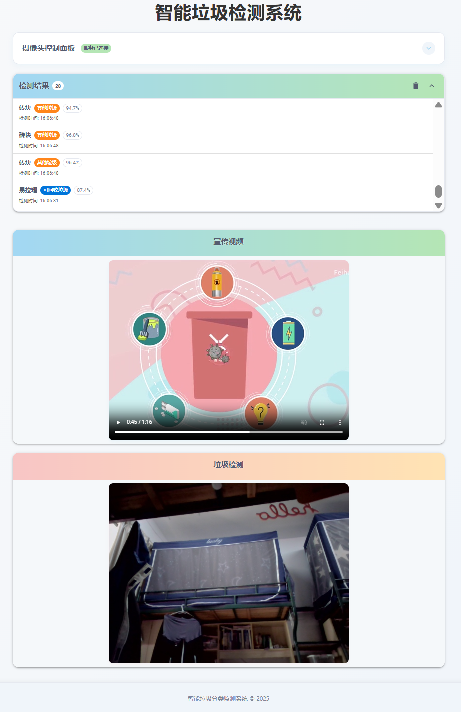

# 垃圾检测系统

这是一个基于 YOLOv8 的垃圾检测系统，包含 Flask 后端和 React 前端。

## 功能特点

- 实时垃圾检测与分类
- 美观的用户界面
- 多摄像头支持
- 开始/停止检测控制

## 安装与运行

### 后端

1. 安装依赖：
   ```
   pip install -r requirements.txt
   ```

2. 运行后端：
   ```
   python app.py
   ```

### 前端

1. 进入前端目录：
   ```
   cd frontend
   ```

2. 安装依赖：
   ```
   npm install
   ```

3. 开发环境运行：
   ```
   npm start
   ```

4. 构建生产版本：
   ```
   npm run build
   ```

### 注意事项

如果在 Windows PowerShell 中运行 npm 命令时遇到执行策略错误，请先运行以下命令临时允许脚本执行：

```powershell
Set-ExecutionPolicy -Scope Process -ExecutionPolicy Bypass
```

然后再尝试运行 npm 命令。此设置仅对当前 PowerShell 会话有效。

或者，您可以使用命令提示符(CMD)来代替 PowerShell 运行 npm 命令，这样就不会遇到执行策略问题。

## 使用方法

1. 启动后端和前端
2. 在浏览器中打开 http://localhost:3000 (开发) 或 http://localhost:5000 (生产)
3. 使用界面上的控制按钮开始/停止检测
4. 可以通过下拉菜单切换不同的摄像头

## 系统要求

- Python 3.8+
- Node.js 14+
- 摄像头或视频设备


## 效果预览

